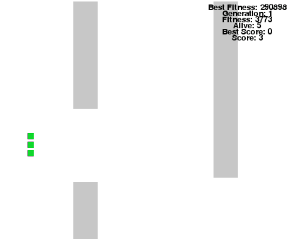
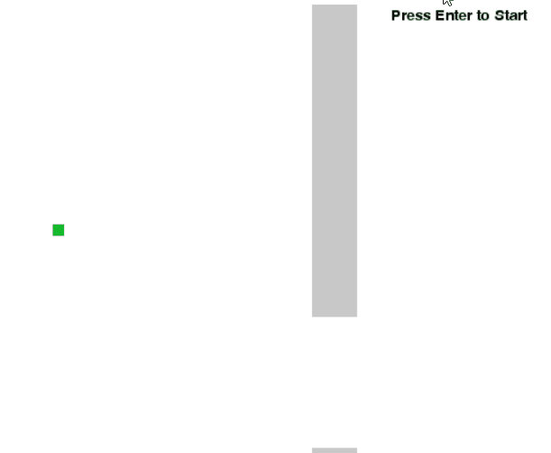
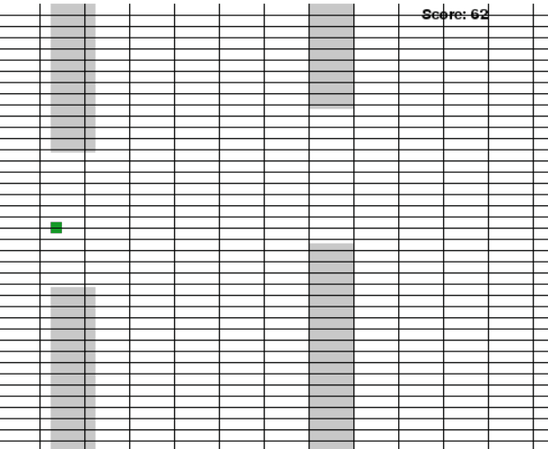
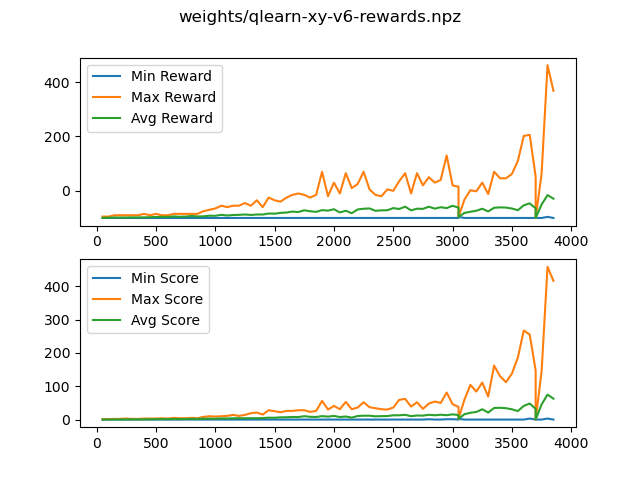

# Flappy Bird

<div id="start"></div>

Intro
---

Flappy bird seemed to be a nice and simple game that I could implement quickly and use that to approach automating the game with machine learning. I hoped to explore the 3 different Machine Learning through this.

* Unsupervised Machine Learning (Genetic Algorithm)
* Supervised Machine Learning (Logistic Regression)
* Reinforced Machine Learning (QLearning)

Quick Links:
---

- [Intro](#start)
- [How-To](#howto)
    - [Play game](#htgame)
    - [Train with Genetic Algorithm](#htga)
    - [Train with Supervised](#htsnn)
    - [Train with Q-learning](#htql)
- [Methods](#methods)
    - [Genetic Algorithm](#ga)
    - [Logistic Regression](#lr)
    - [Q Learning](#ql)
- [File References](#fd)
    - [start.py](#fdstart)
    - [plotter.py](#fdplotter)
    - [core/](#fdcore)
    - [genetic/](#fdgen)
    - [supervised/](#fdsup)
    - [qlearning/](#fdql)
- [Links and References](#links)
- [Bugs and Improvements](#bugs)

<div id="howto"></div>

Start How-To(s)
---

<div id="htgame"></div>

### 1. Playing game

- Set up all necessary requiremnts. You will need python 3 installed before these.
- I also recommend using a virutal environment before installing requirements.
```
$ python3 -m venv venv // python if you only have python3 installed
$ source venv/bin/activate // venv\Scripts\activate if windows
// You can directly run the below code if you don't want to use virtual environment.
(venv) $ pip install -r requirements.txt 
```
- Once all required packages get installed, to play game run:
```
$ python start.py play
```


<div id="htga"></div>

### 2. Starting Training with Genetic Algorithm

- With all packages installed, just run
```
$ python start.py genetic
```
- You can also make it continue from last best weights saved or specify population size from command line.
```
$ python start.py genetic -r -s 100
```

<div id="htsnn"></div>

### 3. Starting Training with Supervised Neural Network

- This part will require keras along with numpy and pygame, so make sure you had all requiremens installed.
- Run:
```
$ python start.py supervised
```
This will first prompt the user to play a round first so that it can gather some initial data
for training the neural network model.
It then uses that to play a round, and after everyround with new collected data retrains the model.

<div id="htql"></div>

### 3. Starting Training with QLearning

- Run:
```
$ python start.py qlearn
```

<div id="methods"></div>

Methods
---

For simplicity I kept the game on the same level and did not include anything like bird or obstacle velocity.
The bird simply stays in the same X position, and jumps affectings its
Y position only.
Obstacles (pipes) are randomly generated a gap ranging `MIN_GAP` and `MAX_GAP` and each obstacle maintain a space between them ranging between `MIN_SPACE` to `MAX_SPACE` (this here has well I made same during trianing to make traning easier).

The `core` part of this project contains the essential funcitonalities
for the game. The other folders extend from those to do their dedicated
approach to training the bird.

---

<div id="ga"></div>

### *Genetic Algorithm*

One of the most popular ways I have seen people automating this game
was gentic algorithm and so I started on first trying this.

My approach to it was using a simple neural network that took the x, y
position of the bird plus the vertical and horizontal distance between
the bird and upcoming obstacle.

To be more specific, vertical distance was the gap's Y_mid - bird's Y_mid for horizontal distance it was obstacle's X_end - bird's X_mid.

So with 4 input, a hidden layer with 8 nodes (and a bias) it gives output a value that I use sigmoid function to generate the probability to jump. If it is above 0.6 (`THRESHOLD`) it will jump.

I mainly trained it using a population size of 100, and the fitness
score used to find best bird was the total distance travelled minus
the horizontal and verticl distance pluss 100 points every score.

The intuition was make birds over time closer to the point, however
I also include score factor, as I think sometimes it may have gotten closer but couldn't score, where another was far but it did pass the gap at least.

The selection part of the algorihtm takes the best 10 of the popultaion, and then randomly generates offspring of the best 3. During crossover
it randoly merges the weights of neural network of both birds' "genes" and on a random probability also swaps the bias value. Also mutates the values adding small random value.

The performance improved really fast with approach and if I recall right, I had a decent performing bird by 10-12th generation.

Here's a small clip of it playing out with trained weights. `weights//gentic-opt.npz` was the best performing weights for me so I had them saved.



---

<div id="lr"></div>

### *Logistic Regression*

Now this was something less popula and to be honest isn't really the right way to approach this problem. While I am aware of it I still wanted to try to implement it. I kept the neural network model
exact same as the one used in genetic algorithm.

Since the first important thing aboout supervised learning is that it needs data it first lets the user play once which it uses to generate a dataset.
It takes all action and considers it the right thing to do and at th end
when the user takes an aciton and dies, it swaps the last action to the other one assuming that would have been the best one.

Then after training a little on it, it tries to play again, and similar repepats the step marking the last action of it before death incorrect and swapping the action value. This way as it plays it should grow to have a larger dataset and I hoped to make it able to learn to play the game.

However it is still not good enough as it would most likely end up with a lot of falsely skewed data, and training would take very very long.

For a long time in my case I was pretty much stuck with this:



Now there are things we can try with this, but I was more excited about reinforcement learning so just jumped to that directly. :P

---

<div id="ql"></div>

### *Q-Learning*

This part was the longest journey for me, something I was sure should work with this yet something I was completely unfamilar with me. Thanks to great 5th week videos of [Introduction Machine Learning](https://www.coursera.org/learn/machine-learning-duke/) by Duke University on [Coursera](https://coursera.org) I manged to get an understanding of how it works, and [sentdex's Reinforcment Learning sereis](https://pythonprogramming.net/q-learning-reinforcement-learning-python-tutorial/) helped me to get an understanding of how to implement it.

Instead of proceeding with NN,  I decided for this to first try simple Q-Learning where it should over time be able to fill up the Q table.
After tinking a bit, it seemd here it performed better when I just used
the co-ordinates as the state values instead of distance. 

I set up a reward for scoring and penalised for dying. Additionally penalised the last jump whenever the bird dies by hitting the upper pipe, to
discourse the policy to do that.

Also instead of updating at the every move, I would append them to a list and update the qtable at the end of the round, starting from the latest experience to earliest. This way I think it gives more emphasis on the points it died or scored. So say if it dies in a move, with the high discount value it takes that more in consideration to update the previous state. Helping the it learn the q values faster.

I tried to make it learn qtable with quite a lot of variation at the last point v6 (`weights/qlearn-xy-v6.npz`) seemed to give a good performance.





So with above you can see after around 3.5K iterations it is able to socreaverage around 50 and even scored high values around 400.

One thing I noticed with the training is that, the smaller the states size the faster it learns but also lower the average score. It seemed to give a good performance with height being split by `Bird`'s height and Width by `Obstacle`'s width.

I did set up epsilon, but at the end I think epsilon doesn't really make a big difference in this case. I think so because the pipes generated are done completely randomly and hence this sort of mimics epsilon and forces the model to explore various states. THis is why we can still see ups and downs.

And also, the sharp down or up were often be cause I stopped and slighly modified learning rate or the reward value. I am not very sure but I think after a little training it helps by scalling up the reward, either by increasing the penalty or lowering the score reward trying to put more incentive on trying to stay alive. It did seem to help improve.

Unfortunately I couldn't get the min score to improve at all. I wonder if DQN could improve it?


<div id="fd"></div>

File Descriptions
---

If you would like to make use of the code feel free to. To help, I have provided a quick explanation of all the soruces, and the code inside each of the files are also documented.

<div id="fdstart"></div>

### `start.py`

This file is used to invoke the different ways to launch the game. It makes use
of command line arguments to determine how to laod the game.

On above how-to's the avialable commands are shared.

<div id="fdplotter"></div>

### `plotter.py`

Used to analyse the progress qleraning was making in training the bird.

-----------------------------------------------------------------------------------

<div id="fdcore"></div>

### `core/`

*This folder mainly consist of all the models providing essential feature for the game.*

`core/bird.py`

Contains `Bird` class. It contains the position and score information of the bird. Provides
methods to let bird move and jump in the game.

`core/obstacles.py`

Contains `Obstacle` class. Prepares and handles the obstacles of the game.
Here each obstacle are simply the boxes that leave a small gap inbetween.

`core/game.py`

Contains the `Game` class that handles the game loop and states.

------------------------------------------------------------------------------------

<div id="fdgen"></div>

### `genetic/`

*The folder containig extended classes of Game and Bird for making it suitable
for genetic algorithm and letting bird learn to play the game.*

`genetic/bird.py`

Provides `Genes` and `GeneticBird` class. `Genes` provide the basic functionality for
the model that handles the weight and uses to get decision for the bird to jump
or not.

The `GeneticBird` class uses a `Genes` object to determine jump and also
uses a fitness score to compare between different birds.

`genetic/trainer.py`

The `GeneticTrainer` class is used to loop over the game with the genetic birds
and uses the concept of genetic algorithm to evolve the birds to learn to
play the game.

------------------------------------------------------------------------------------

<div id="fdsup"></div>

### `supervised/`

*This folder contains extended classes for making the flappy bird AI learn to play
the game using the concept of supervised machine learning. It uses the same
neural network model as the genetic algorithm one, but here it tries to collect the
interaction and train the model to learn to play the game.*

*It first prompts the user to play the game, where it takes the input set and user's 
action to label X and Y. In a case if user's decision led ot the bird crashing,
it switches the label in that case.*

`supervised/bird.py`

This file contains the `Model` and `SupervisedBird` class. The `Model` class basically
provides the methods to maintain the neural network model. `SupervisedBird` uses `Model`
to decide whehter to jump or not, unlike `Bird` in the core game that uses user interaction.

`supervised/trainer.py`

This contains the `GameDataGen` and `SupervisedTrainer` class. `GameDataGen` extends game
and adjusts to collect user data, and allows uer to play once only. `SupervisedTrainer`
extends `GameDataGen` as it also collects data from the play, so to avoid duplication I did
this inheritance. It modifies `loop`, `event_check` and `bird_update` method to make the 
bird jump using AI instead of user invoked events.

------------------------------------------------------------------------------------

<div id="fdql"></div>

### `qlearning/`

*This folder contains the classes to train the bird learning to play the game
using qlearning method.*

`qlearning/trainer.py`

This file contains all of the code for qlearning. It has the class `QTable` that
handles a numpy array consisting the Q function values for each state.
`ReinforcedTrainer` uses `QTable` to get the action value and that makes the
`Bird` (`core`) jump or not. The state details are handled inside the trainer class.
It defines the dimensions for the qtable and gets the distinc bins from the state.

<div id="links"></div>

Links and References
---

- [Introduction Machine Learning](https://www.coursera.org/learn/machine-learning-duke/) - Helped me to understand how Q-Learning works
- [sentdex's Reinforcment Learning sereis](https://pythonprogramming.net/q-learning-reinforcement-learning-python-tutorial/) - Helped me to get an idea of how to implement it.
- [chncyhn/flappybird-qlearning-bot](https://github.com/chncyhn/flappybird-qlearning-bot) - I got the idea of listing the expriences and penalising last jump from his README.
- [Introduction to Optimiation with genetic algorithm](https://towardsdatascience.com/introduction-to-optimization-with-genetic-algorithm-2f5001d9964b) - To learn about genetic algorithm

<div id="bugs"></div>

Bugs and Improvements
---

Just listing some noticable bugs or possible improvemnets here:

- When training with genetic algorithm, the current score doesn't update correclty, this is probably because I am not properly updating the score value that is displayed.
- Poor GUI, might be a good idea to make it look pretty.
- Using DQN where maybe feed in the whole screen as an image as the input to the model.
- Using the q-table and genetic algorithm to prepare dataset for the supervised learning model
- Using SARSA with q-learnng

I think there can be a lot more to explore with machine learning, as there can be many factors that can help improve it.